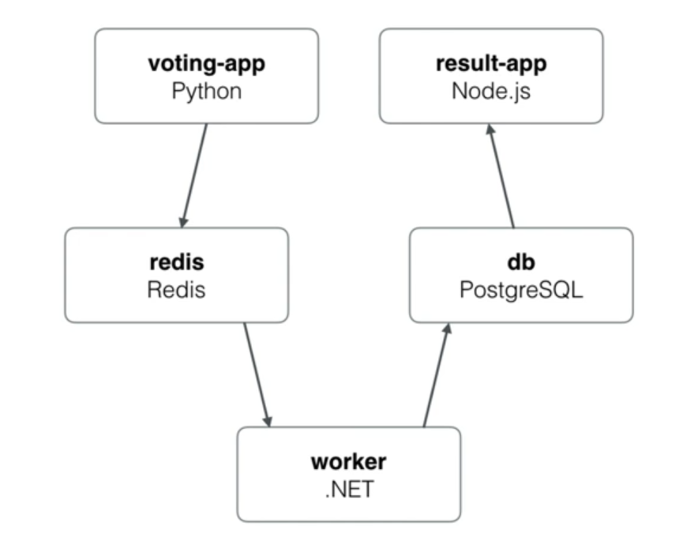
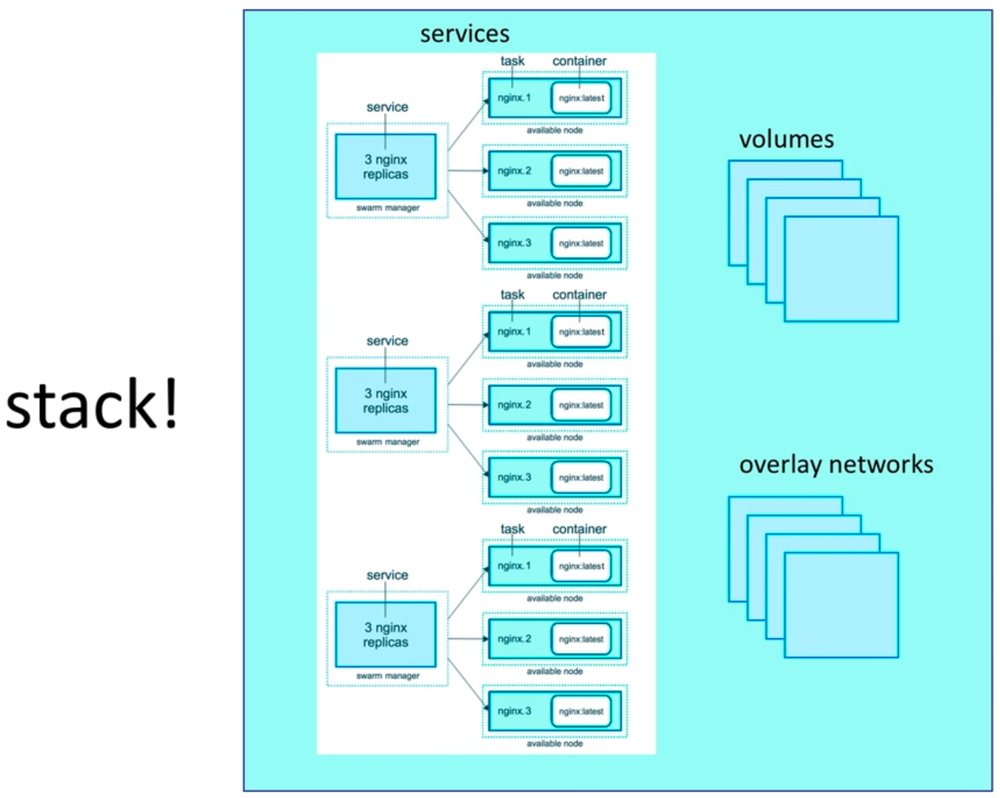
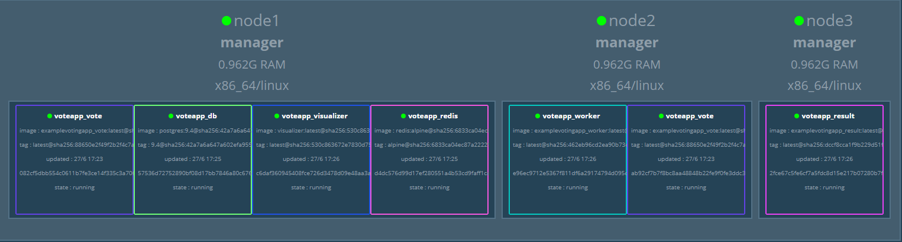

<!-- @format -->

*This is a personal notebook I'll be filling up while learning about Docker and associated tools, daily*
# Docker notes


## Introduction

Image is the application we want to run. Container is an instance of that image running as a process.

**Our image in this course will be Nginx web server**

`docker container run --publish 80:80 --detach --name webhost1 nginx (downloaded image from dockerhub, started a new container from that image and opened port 80 on localhost)`

Containers and VM's aren't the same thing, container is just a restricted process in the OS.

**To CLI into a container, we do it like this:**

`docker container run -it --name proxy nginx bash`

**To start a stopped container, do this**

`docker container start -ai ubuntu`

**To CLI into an already running container, do this** (exiting it doesn't stop the container like the case with the top one, because it wasn't started with bash command, but with exec)

`docker container exec -it mysql bash`

### Docker networks

**To create a docker network where we can attach containers** (bridge driver by default)

`docker network create my_app_nett`

**To start a container on new network**

`docker container run -d --name new_nginx --network my_app_nett nginx`

**To connect a docker from my default network to my new network, I do**

`docker network connect <network id> <container id>`

**To disconnect**

`docker network disconnect <network id> <container id>`

The reason these networks exist is for protection - keep ports safe, lets say keep frontend on one network, backend on another.

**When we put containers on the same network, they can talk to each other**
`docker container exec -it nginx1 ping nginx2 (nginx1 container pings nginx2 container)`

Containers shouldn't rely on IP addresses when talking to each other, DNS automatically resolves that in the background (inter-communication between containers).

### Docker alias

**To give a container an alias we do it like this**
`docker container run -d --name elsearch1 --network round_robin --network-alias search elasticsearch:2`

**To run a command within a container and instantly exit it upon it completing**
`docker container --rm --net round_robin alpine:3.10 nslookup search (enters alpine:3.10 container, does nslookup search to see all addresses on my round_robin network)`

This was a round robin test - set up 2 identical containers with same alias (search). When you call a function on those containers, either one of them responds, depending who gets reached first. Basically, if one fails, the other one can do the same task with no interruptions (think of multiple servers accross the world for google or riot).

### Tags

**To retag a repo, do this**
`docker image tag nginx dantesvn/nginx`

**To push a repo on docker hub, we do this**
`docker image push dantesvn/nginx`

## Dockerfile

**To build an image from dockerfile**
`docker image build -t customnginx . (-t is tag, customnginx is name of image)`

Order of lines matters in dockerfile, keep those lines that change the least at the top, because everything after the changed line has to be rebuilt again.

### Volumes and Bind mounts

Containers are supposed to be immutable - don't change containers, just re deploy it with changes, what about databases though? Containers shouldn't contain that kind of data, unique data is supposed to be in a special place. Docker has two options for containers to store files in the host machine, so that the files are persisted even after the container stops: **volumes, and bind mounts**.

**Volumes** are stored in a part of the host filesystem which is managed by Docker (/var/lib/docker/volumes/ on Linux). Non-Docker processes should not modify this part of the filesystem. Volumes are the best way to persist data in Docker.
**Bind mounts** may be stored anywhere on the host system, they may even be important system files or directories. Non-Docker processes on the Docker host or a Docker container can modify them at any time.

**To create and name a volume, and have a container on it, we add this to the docker container run command**

`v mysql-db:/var/lib/mysql (-volume, name, location)`

Bind Mounting maps a host file or directory to a container file or directory. Can't use in Dockerfile, must be at container run.
`... run -v //C/Users/Bogdan/Desktop:/path/container`
`docker container run -d --name nginx -p 80:80 -v ${pwd}:/usr/share/nginx/html nginx (${pwd} is "print working directory", basically my current working directory)`

## Docker Compose 

**Docker Compose** is used to configure relationships between containers. It saves our docker run settings in easy to read file, which leads to one-liner developer environment startups. Its comprised of 2 separate but related things:
1) YAML formatted file that describes our solution options for containers, networks and volumes
2) A CLI tool docker-compose used for local dev/test automation with those YAML files

A template of a docker-compose.yml looks like this
```
version: '3.1'  # if no version is specified then v1 is assumed. Recommend v2 minimum

services:  # containers. same as docker run
  servicename: # a friendly name. this is also DNS name inside network
    image: # Optional if you use build:
    command: # Optional, replace the default CMD specified by the image
    environment: # Optional, same as -e in docker run
    volumes: # Optional, same as -v in docker run
  servicename2:

volumes: # Optional, same as docker volume create

networks: # Optional, same as docker network create
```
docker-compose CLI is not a production-grade tool but it's ideal for local dev and test. 

**Two most common commands are:**

`docker-compose up` (setup volumes/networks and start all containers)

`docker-compose down` (stop all containers and remove cont/vol/net)

Compose can also build custom images. It will build them with docker-compose up if not found in cache.

```
version: '2'

# based off compose-sample-2, only we build nginx.conf into image
# uses sample HTML static site from https://startbootstrap.com/themes/agency/

services:
  proxy:
    build:
      context: .
      dockerfile: nginx.Dockerfile
    ports:
      - '80:80'
  web:
    image: httpd
    volumes:
      - ./html:/usr/local/apache2/htdocs/
```
For example, in here, first service is a custom image built based on nginx.Dockerfile:
```
FROM nginx:1.13

COPY nginx.conf /etc/nginx/conf.d/default.conf
```
The dockerfile states a custom .conf file replacing the default one in nginx image:
```
server {

	listen 80;

	location / {

		proxy_pass         http://web;
		proxy_redirect     off;
		proxy_set_header   Host $host;
		proxy_set_header   X-Real-IP $remote_addr;
		proxy_set_header   X-Forwarded-For $proxy_add_x_forwarded_for;
		proxy_set_header   X-Forwarded-Host $server_name;

	}
}
```
It's just copying this data into the default image, thus making it "different" - custom-nginx. Docker-compose up then builds it based on yaml file where all of this is connected, using httpd (apache) server and bind-mounting the html files in directory, so it display a static website.

## Docker Swarm

How do we scale out/in/up/down?
How can we ensure our containers are re-created if they fail?
How can we replace containers without downtime?
How can we control/track where containers get started?
How can we create cross-node virtual networks?
How can we ensure only trusted servers run our containers?
How can we store secrets, keys, passwords and get them to the right container (and only that container)?

**Swarm Mode: Built-In Orchestration**

Swarm mode is a clustering solution built inside Docker. It's not enabled by default, once enabled we get access to: 
```
docker swarm
docker node
docker service
docker stack
docker secret
```
A Docker Swarm is a group of either physical or virtual machines that are running the Docker application and that have been configured to join together in a cluster. Once a group of machines have been clustered together, you can still run the Docker commands that you're used to, but they will now be carried out by the machines in your cluster. The activities of the cluster are controlled by a swarm manager, and machines that have joined the cluster are referred to as nodes.
Docker swarm is a container orchestration tool, meaning that it allows the user to manage multiple containers deployed across multiple host machines.
One of the key benefits associated with the operation of a docker swarm is the high level of availability offered for applications. In a docker swarm, there are typically several worker nodes and at least one manager node that is responsible for handling the worker nodes' resources efficiently and ensuring that the cluster operates efficiently.

**To initialize swarm on docker, do:**

`docker swarm init `

**The terminal will output a token you use to connect other nodes to your current leader node:**

`docker swarm join --token <your token> 192.168.65.3:2377`

**To list all current nodes (only 1 - leader node so far):**

`docker node ls`

**To run a service and have it do something:**

`docker service create alpine ping 8.8.8.8`

**To scale up this service, by making it have 3 replicas:**

`docker service update <service id> --replicas 3` 

Even if we force remove a running container on swarm, swarm will automatically start it up back again to match specified replica (if we set up 3, and deleted 1, it will automatically revive it to match 3/3). That's the point of an orchestration service, make sure it **always runs!** Docker run would never recreate a removed container, while the whole point of orchestration is to keep everything running accross all nodes.

**To shut it down, we actually have to shut down the service:**

`docker service rm <service id>`

**To create a "remote" node for testing**, we use **docker-machine**, which boots up a docker ready linux image in a VM for our swarm purposes. I am going to create 3 nodes:
```
docker-machine create node1
docker-machine create node2
docker-machine create node3
```
**To access the newly created machine, we can do:**
```
docker-machine ssh node1
docker-machine ssh node2
docker-machine ssh node3
```

**Command `docker swarm init` probably won't work on its own due to how cloud works, so we use in each of the nodes:**

`docker swarm init --advertise-addr <IP address>`

This turns node1 into swarm manager, and pasting the token into node2 and node3 makes them "workers" and connects them to node1 (manager), thus making the swarm.

Only swarm manager can use swarm commands, running `docker node ls` on node2 or node3 will throw an error.

**This command turns node2 into a manager as well:**

`docker node update --role manager node2`

**We can also make a node a manager by getting the join-token manager. Only works on nodes that haven't already joined:**

`docker swarm join-token manager`

**To list the running service accross nodes:**

`docker service ps <service name>`

**To create a network for our swarm:**

`docker network create --driver overlay <network name>`

I set up both postgres and drupal service - postgres started on node1, drupal on node2. Hitting any of the node IP addresses opens up drupal setup in browser. This lets drupal and postgres talk to each other because they're on the same network overlay, and you can use all 3 node IP addresses to access drupal.

What lets containers talk to each other is actually **Routing Mesh**. It routes incoming packets for a service to proper task, spans all nodes in swarm and it load balances swarm services across their tasks. 
Two ways this works:
1) Container-to-Container in a Overlay network (just like I used it now)
2) External traffic incoming to published ports (all nodes listen)

**A real life example of an app with python frontend and nodejs backend, redis, workers and postgres running in a 3 node swarm:**



```
docker network create --driver overlay backend
docker network create --driver overlay frontend

docker service create --name vote --network frontend -p 80:80 --replicas 3 bretfisher/examplevotingapp_vote
docker service create --name redis --network frontend redis:3.2
docker service create --name worker --network backend --network frontend bretfisher/examplevotingapp_worker
docker service create --name db --network backend -e POSTGRES_HOST_AUTH_METHOD=trust --mount type=volume,source=db-data,target=/var/lib/postgresql/data postgres:9.4
docker service create --name result --network backend -p 5001:80 bretfisher/examplevotingapp_result
```
<br>

### Stacks: Production grade Compose

Stacks is basically a Compose file for Swarm. We use `docker stack deploy` rather than `docker service create`. Stack manages all those objects for us, including overlay network per stack. There's also a new `deploy: ` key in Compose file, we can't do `build: `. Building shouldn't happen on production swarm. Stack essentially lets me manage services, its replicas, volues and overlay networks in a single file.



An example of a swarm stack file, in case of our voting app, is below, and we'd run it with `docker stack deploy -c <compose filename>.yml <name of stack>`

```
version: "3"
services:

  redis:
    image: redis:alpine
    networks:
      - frontend
    deploy:
      replicas: 1
      update_config:
        parallelism: 2
        delay: 10s
      restart_policy:
        condition: on-failure
  db:
    image: postgres:9.4
    volumes:
      - db-data:/var/lib/postgresql/data
    networks:
      - backend
    environment:
      - POSTGRES_HOST_AUTH_METHOD=trust
    deploy:
      placement:
        constraints: [node.role == manager]
  vote:
    image: bretfisher/examplevotingapp_vote
    ports:
      - 5000:80
    networks:
      - frontend
    depends_on:
      - redis
    deploy:
      replicas: 2
      update_config:
        parallelism: 2
      restart_policy:
        condition: on-failure
  result:
    image: bretfisher/examplevotingapp_result
    ports:
      - 5001:80
    networks:
      - backend
    depends_on:
      - db
    deploy:
      replicas: 1
      update_config:
        parallelism: 2
        delay: 10s
      restart_policy:
        condition: on-failure

  worker:
    image: bretfisher/examplevotingapp_worker
    networks:
      - frontend
      - backend
    depends_on:
      - db
      - redis
    deploy:
      mode: replicated
      replicas: 1
      labels: [APP=VOTING]
      restart_policy:
        condition: on-failure
        delay: 10s
        max_attempts: 3
        window: 120s
      placement:
        constraints: [node.role == manager]

  visualizer:
    image: dockersamples/visualizer
    ports:
      - 8080:8080
    stop_grace_period: 1m30s
    networks:
      - frontend
    volumes:
      - /var/run/docker.sock:/var/run/docker.sock
    deploy:
      placement:
        constraints: [node.role == manager]

networks:
  frontend:
  backend:

volumes:
  db-data:
```

**Once started, an easy way to check on running services is using:**

`docker stack ps <name of stack>`

The container `visualizer` we added to the voting app can be accessed on ip:8080, and it shows the data of our running swarm:



<br>

### Secrets Storage

Easiest secure solution for storing secrets in Swarm, its already included in Swarm. A secret can be usernames and passwords, TLS certificates and keys, SSH key, or any other API key, ie. anything that shouldn't be seen. It supports generic strings or binary content up to 500kb in size, and doesn't require any rewriting.

**Two ways to create a secret:**
1) Store secrets in a text file, go to CLI and `docker secret create <secret name> <secret_file.txt>`
2) Echo it from a command line: `echo "<my password>" | docker secret create <secret name> -`

**To practically implement this, we can do:**

`docker service create --name psql --secret psql_user --secret psql_pass -e POSTGRES_PASSWORD_FILE=/run/secrets/psql_pass -e POSTGRES_USER_FILE=/run/secrets/psql_user postgres`

This command creates a service that uses our username and password secret file as arguments for username/password -e requirement of postgres.

Text files for secrets are obviously not used in real life scenarios.

### Full App Lifecycle with Compose

By default, Compose reads two files, a `docker-compose.yml` and an optional `docker-compose.override.yml` file. By convention, `the docker-compose.yml` contains your base configuration. The override file, as its name implies, can contain configuration overrides for existing services or entirely new services.

If a service is defined in both files, Compose merges the configurations using the rules described in Adding and overriding configuration.

To use multiple override files, or an override file with a different name, you can use the -f option to specify the list of files. Compose merges files in the order they’re specified on the command line. 

The specific use case for this are different environment, as seen in **`swarm-stack-3` folder**. 

**docker-compose.yml** (base, with only 2 images)
```
version: '3.1'

services:

  drupal:
    image: custom-drupal:latest

  postgres:
    image: postgres:12.1

```

**docker-compose.override.yml** (adds onto base)
```
version: '3.1'

services:

  drupal:
    build: .
    ports:
      - "8080:80"
    volumes:
      - drupal-modules:/var/www/html/modules
      - drupal-profiles:/var/www/html/profiles
      - drupal-sites:/var/www/html/sites
      - ./themes:/var/www/html/themes
 
  postgres:
    environment:
      - POSTGRES_PASSWORD_FILE=/run/secrets/psql-pw
    secrets:
      - psql-pw
    volumes:
      - drupal-data:/var/lib/postgresql/data

volumes:
  drupal-data:
  drupal-modules:
  drupal-profiles:
  drupal-sites:
  drupal-themes:

secrets:
  psql-pw:
    file: psql-fake-password.txt
```
**docker-compose.prod.yml** (prod env, only difference is external secret)
```
version: '3.1'

services:

  drupal:
    ports:
      - "80:80"
    volumes:
      - drupal-modules:/var/www/html/modules
      - drupal-profiles:/var/www/html/profiles
      - drupal-sites:/var/www/html/sites
      - drupal-themes:/var/www/html/themes
 
  postgres:
    environment:
      - POSTGRES_PASSWORD_FILE=/run/secrets/psql-pw
    secrets:
      - psql-pw
    volumes:
      - drupal-data:/var/lib/postgresql/data

volumes:
  drupal-data:
  drupal-modules:
  drupal-profiles:
  drupal-sites:
  drupal-themes:

secrets:
  psql-pw:
    external: true
```

**docker-compose.test.yml** (sample data on volumes, for testing purposes)
```
version: '3.1'

services:

  drupal:
    image: custom-drupal
    build: .
    ports:
      - "80:80"

  postgres:
    environment:
      - POSTGRES_PASSWORD_FILE=/run/secrets/psql-pw
    secrets:
      - psql-pw
    volumes:
      # NOTE: this might be sample data you host in your CI server
      # so you can do integration testing with sample data
      # this may not work on Docker for Windows/Mac due to bind-mounting
      # database data across OSes, which doesn't always work
      # in those cases you should use named volumes
      - ./sample-data:/var/lib/postgresql/data
secrets:
  psql-pw:
    file: psql-fake-password.txt
```

A simple `docker-compose up` will run the override file. On the other hand, `docker-compose -f docker-compose.yml -f docker-compose.prod.yml config > output.yml` will replace/merge the base file with the production file, and it will output the yml. Note that `up` isn't used, but `config`.

### Service Updates

They provide rolling replacement of tasks/containers in a service, and it limits downtime. Stack deploy, when pre-existing, will issue service updates.

**To update a service image:**

`docker service update --image myapp:1.2.1 <servicename>`

**To add an environment variable and remove a port:**

`docker service update --env-add NODE_ENV=production --publish-rm 8080`

**To change number of replicas of two services**

`docker service scale web=8 api=6`

Regarding **Swarm**, just edit the YAML file, and then `docker stack deploy -c file.ylm <stackname>`, as usual.

You can't "update" a port on the fly, you have to remove the current one and add a new one. The current service I use is a nginx server with name "web" on port 8088, so:

`docker service update --publish-rm 8088 --publish-add 9090:80 web`

Sometimes, tasks won't be evenly split between nodes. To force the scheduler to split them up the best way, do 

`docker service update --force <servicename>`

### Docker Healthchecks

Supported in Dockerfile, Compose YAML, docker run, and Swarm Services. It expects `exit 0` (OK) or `exit 1` (ERROR). It only has **3 states: starting, healthy and unhealthy**. Services will replace tasks if they fail healthcheck.

The **HEALTHCHECK** instruction has two forms:

`HEALTHCHECK [OPTIONS] CMD command` (check container health by running a command inside the container)
`HEALTHCHECK NONE` (disable any healthcheck inherited from the base image)
The HEALTHCHECK instruction tells Docker how to test a container to check that it is still working. This can detect cases such as a web server that is stuck in an infinite loop and unable to handle new connections, even though the server process is still running.

When a container has a healthcheck specified, it has a health status in addition to its normal status. This status is initially starting. Whenever a health check passes, it becomes healthy (whatever state it was previously in). After a certain number of consecutive failures, it becomes unhealthy.

The options that can appear before CMD are:

`--interval=DURATION (default: 30s)`
`--timeout=DURATION (default: 30s)`
`--start-period=DURATION (default: 0s)`
`--retries=N (default: 3)`

The health check will first run interval seconds after the container is started, and then again interval seconds after each previous check completes. If a single run of the check takes longer than timeout seconds then the check is considered to have failed. It takes retries consecutive failures of the health check for the container to be considered unhealthy.

