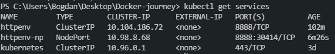

<!-- @format -->

*This is a personal notebook I'll be filling up while learning about Docker and associated tools, daily*
# Docker notes


  * [Introduction](#introduction)
    + [Docker networks](#docker-networks)
    + [Docker alias](#docker-alias)
    + [Tags](#tags)
  * [Dockerfile](#dockerfile)
    + [Volumes and Bind mounts](#volumes-and-bind-mounts)
  * [Docker Compose](#docker-compose)
  * [Docker Swarm](#docker-swarm)
    + [Stacks: Production grade Compose](#stacks--production-grade-compose)
    + [Secrets Storage](#secrets-storage)
    + [Full App Lifecycle with Compose](#full-app-lifecycle-with-compose)
    + [Service Updates](#service-updates)
    + [Docker Healthchecks](#docker-healthchecks)
    + [Container Registries](#container-registries)

## Introduction

Image is the application we want to run. Container is an instance of that image running as a process.

**Our image in this course will be Nginx web server**

`docker container run --publish 80:80 --detach --name webhost1 nginx (downloaded image from dockerhub, started a new container from that image and opened port 80 on localhost)`

Containers and VM's aren't the same thing, container is just a restricted process in the OS.

**To CLI into a container, we do it like this:**

`docker container run -it --name proxy nginx bash`

**To start a stopped container, do this**

`docker container start -ai ubuntu`

**To CLI into an already running container, do this** (exiting it doesn't stop the container like the case with the top one, because it wasn't started with bash command, but with exec)

`docker container exec -it mysql bash`

### Docker networks

**To create a docker network where we can attach containers** (bridge driver by default)

`docker network create my_app_nett`

**To start a container on new network**

`docker container run -d --name new_nginx --network my_app_nett nginx`

**To connect a docker from my default network to my new network, I do**

`docker network connect <network id> <container id>`

**To disconnect**

`docker network disconnect <network id> <container id>`

The reason these networks exist is for protection - keep ports safe, lets say keep frontend on one network, backend on another.

**When we put containers on the same network, they can talk to each other**
`docker container exec -it nginx1 ping nginx2 (nginx1 container pings nginx2 container)`

Containers shouldn't rely on IP addresses when talking to each other, DNS automatically resolves that in the background (inter-communication between containers).

### Docker alias

**To give a container an alias we do it like this**
`docker container run -d --name elsearch1 --network round_robin --network-alias search elasticsearch:2`

**To run a command within a container and instantly exit it upon it completing**
`docker container --rm --net round_robin alpine:3.10 nslookup search (enters alpine:3.10 container, does nslookup search to see all addresses on my round_robin network)`

This was a round robin test - set up 2 identical containers with same alias (search). When you call a function on those containers, either one of them responds, depending who gets reached first. Basically, if one fails, the other one can do the same task with no interruptions (think of multiple servers accross the world for google or riot).

### Tags

**To retag a repo, do this**
`docker image tag nginx dantesvn/nginx`

**To push a repo on docker hub, we do this**
`docker image push dantesvn/nginx`

## Dockerfile

**To build an image from dockerfile**
`docker image build -t customnginx . (-t is tag, customnginx is name of image)`

Order of lines matters in dockerfile, keep those lines that change the least at the top, because everything after the changed line has to be rebuilt again.

### Volumes and Bind mounts

Containers are supposed to be immutable - don't change containers, just re deploy it with changes, what about databases though? Containers shouldn't contain that kind of data, unique data is supposed to be in a special place. Docker has two options for containers to store files in the host machine, so that the files are persisted even after the container stops: **volumes, and bind mounts**.

**Volumes** are stored in a part of the host filesystem which is managed by Docker (/var/lib/docker/volumes/ on Linux). Non-Docker processes should not modify this part of the filesystem. Volumes are the best way to persist data in Docker.
**Bind mounts** may be stored anywhere on the host system, they may even be important system files or directories. Non-Docker processes on the Docker host or a Docker container can modify them at any time.

**To create and name a volume, and have a container on it, we add this to the docker container run command**

`v mysql-db:/var/lib/mysql (-volume, name, location)`

Bind Mounting maps a host file or directory to a container file or directory. Can't use in Dockerfile, must be at container run.
`... run -v //C/Users/Bogdan/Desktop:/path/container`
`docker container run -d --name nginx -p 80:80 -v ${pwd}:/usr/share/nginx/html nginx (${pwd} is "print working directory", basically my current working directory)`

## Docker Compose 

**Docker Compose** is used to configure relationships between containers. It saves our docker run settings in easy to read file, which leads to one-liner developer environment startups. Its comprised of 2 separate but related things:
1) YAML formatted file that describes our solution options for containers, networks and volumes
2) A CLI tool docker-compose used for local dev/test automation with those YAML files

A template of a docker-compose.yml looks like this
```
version: '3.1'  # if no version is specified then v1 is assumed. Recommend v2 minimum

services:  # containers. same as docker run
  servicename: # a friendly name. this is also DNS name inside network
    image: # Optional if you use build:
    command: # Optional, replace the default CMD specified by the image
    environment: # Optional, same as -e in docker run
    volumes: # Optional, same as -v in docker run
  servicename2:

volumes: # Optional, same as docker volume create

networks: # Optional, same as docker network create
```
docker-compose CLI is not a production-grade tool but it's ideal for local dev and test. 

**Two most common commands are:**

`docker-compose up` (setup volumes/networks and start all containers)

`docker-compose down` (stop all containers and remove cont/vol/net)

Compose can also build custom images. It will build them with docker-compose up if not found in cache.

```
version: '2'

# based off compose-sample-2, only we build nginx.conf into image
# uses sample HTML static site from https://startbootstrap.com/themes/agency/

services:
  proxy:
    build:
      context: .
      dockerfile: nginx.Dockerfile
    ports:
      - '80:80'
  web:
    image: httpd
    volumes:
      - ./html:/usr/local/apache2/htdocs/
```
For example, in here, first service is a custom image built based on nginx.Dockerfile:
```
FROM nginx:1.13

COPY nginx.conf /etc/nginx/conf.d/default.conf
```
The dockerfile states a custom .conf file replacing the default one in nginx image:
```
server {

	listen 80;

	location / {

		proxy_pass         http://web;
		proxy_redirect     off;
		proxy_set_header   Host $host;
		proxy_set_header   X-Real-IP $remote_addr;
		proxy_set_header   X-Forwarded-For $proxy_add_x_forwarded_for;
		proxy_set_header   X-Forwarded-Host $server_name;

	}
}
```
It's just copying this data into the default image, thus making it "different" - custom-nginx. Docker-compose up then builds it based on yaml file where all of this is connected, using httpd (apache) server and bind-mounting the html files in directory, so it display a static website.

## Docker Swarm

How do we scale out/in/up/down?
How can we ensure our containers are re-created if they fail?
How can we replace containers without downtime?
How can we control/track where containers get started?
How can we create cross-node virtual networks?
How can we ensure only trusted servers run our containers?
How can we store secrets, keys, passwords and get them to the right container (and only that container)?

**Swarm Mode: Built-In Orchestration**

Swarm mode is a clustering solution built inside Docker. It's not enabled by default, once enabled we get access to: 
```
docker swarm
docker node
docker service
docker stack
docker secret
```
A Docker Swarm is a group of either physical or virtual machines that are running the Docker application and that have been configured to join together in a cluster. Once a group of machines have been clustered together, you can still run the Docker commands that you're used to, but they will now be carried out by the machines in your cluster. The activities of the cluster are controlled by a swarm manager, and machines that have joined the cluster are referred to as nodes.
Docker swarm is a container orchestration tool, meaning that it allows the user to manage multiple containers deployed across multiple host machines.
One of the key benefits associated with the operation of a docker swarm is the high level of availability offered for applications. In a docker swarm, there are typically several worker nodes and at least one manager node that is responsible for handling the worker nodes' resources efficiently and ensuring that the cluster operates efficiently.

**To initialize swarm on docker, do:**

`docker swarm init `

**The terminal will output a token you use to connect other nodes to your current leader node:**

`docker swarm join --token <your token> 192.168.65.3:2377`

**To list all current nodes (only 1 - leader node so far):**

`docker node ls`

**To run a service and have it do something:**

`docker service create alpine ping 8.8.8.8`

**To scale up this service, by making it have 3 replicas:**

`docker service update <service id> --replicas 3` 

Even if we force remove a running container on swarm, swarm will automatically start it up back again to match specified replica (if we set up 3, and deleted 1, it will automatically revive it to match 3/3). That's the point of an orchestration service, make sure it **always runs!** Docker run would never recreate a removed container, while the whole point of orchestration is to keep everything running accross all nodes.

**To shut it down, we actually have to shut down the service:**

`docker service rm <service id>`

**To create a "remote" node for testing**, we use **docker-machine**, which boots up a docker ready linux image in a VM for our swarm purposes. I am going to create 3 nodes:
```
docker-machine create node1
docker-machine create node2
docker-machine create node3
```
**To access the newly created machine, we can do:**
```
docker-machine ssh node1
docker-machine ssh node2
docker-machine ssh node3
```

**Command `docker swarm init` probably won't work on its own due to how cloud works, so we use in each of the nodes:**

`docker swarm init --advertise-addr <IP address>`

This turns node1 into swarm manager, and pasting the token into node2 and node3 makes them "workers" and connects them to node1 (manager), thus making the swarm.

Only swarm manager can use swarm commands, running `docker node ls` on node2 or node3 will throw an error.

**This command turns node2 into a manager as well:**

`docker node update --role manager node2`

**We can also make a node a manager by getting the join-token manager. Only works on nodes that haven't already joined:**

`docker swarm join-token manager`

**To list the running service accross nodes:**

`docker service ps <service name>`

**To create a network for our swarm:**

`docker network create --driver overlay <network name>`

I set up both postgres and drupal service - postgres started on node1, drupal on node2. Hitting any of the node IP addresses opens up drupal setup in browser. This lets drupal and postgres talk to each other because they're on the same network overlay, and you can use all 3 node IP addresses to access drupal.

What lets containers talk to each other is actually **Routing Mesh**. It routes incoming packets for a service to proper task, spans all nodes in swarm and it load balances swarm services across their tasks. 
Two ways this works:
1) Container-to-Container in a Overlay network (just like I used it now)
2) External traffic incoming to published ports (all nodes listen)

**A real life example of an app with python frontend and nodejs backend, redis, workers and postgres running in a 3 node swarm:**


```
docker network create --driver overlay backend
docker network create --driver overlay frontend

docker service create --name vote --network frontend -p 80:80 --replicas 3 bretfisher/examplevotingapp_vote
docker service create --name redis --network frontend redis:3.2
docker service create --name worker --network backend --network frontend bretfisher/examplevotingapp_worker
docker service create --name db --network backend -e POSTGRES_HOST_AUTH_METHOD=trust --mount type=volume,source=db-data,target=/var/lib/postgresql/data postgres:9.4
docker service create --name result --network backend -p 5001:80 bretfisher/examplevotingapp_result
```
<br>

### Stacks: Production grade Compose

Stacks is basically a Compose file for Swarm. We use `docker stack deploy` rather than `docker service create`. Stack manages all those objects for us, including overlay network per stack. There's also a new `deploy: ` key in Compose file, we can't do `build: `. Building shouldn't happen on production swarm. Stack essentially lets me manage services, its replicas, volues and overlay networks in a single file.


An example of a swarm stack file, in case of our voting app, is below, and we'd run it with `docker stack deploy -c <compose filename>.yml <name of stack>`

```
version: "3"
services:

  redis:
    image: redis:alpine
    networks:
      - frontend
    deploy:
      replicas: 1
      update_config:
        parallelism: 2
        delay: 10s
      restart_policy:
        condition: on-failure
  db:
    image: postgres:9.4
    volumes:
      - db-data:/var/lib/postgresql/data
    networks:
      - backend
    environment:
      - POSTGRES_HOST_AUTH_METHOD=trust
    deploy:
      placement:
        constraints: [node.role == manager]
  vote:
    image: bretfisher/examplevotingapp_vote
    ports:
      - 5000:80
    networks:
      - frontend
    depends_on:
      - redis
    deploy:
      replicas: 2
      update_config:
        parallelism: 2
      restart_policy:
        condition: on-failure
  result:
    image: bretfisher/examplevotingapp_result
    ports:
      - 5001:80
    networks:
      - backend
    depends_on:
      - db
    deploy:
      replicas: 1
      update_config:
        parallelism: 2
        delay: 10s
      restart_policy:
        condition: on-failure

  worker:
    image: bretfisher/examplevotingapp_worker
    networks:
      - frontend
      - backend
    depends_on:
      - db
      - redis
    deploy:
      mode: replicated
      replicas: 1
      labels: [APP=VOTING]
      restart_policy:
        condition: on-failure
        delay: 10s
        max_attempts: 3
        window: 120s
      placement:
        constraints: [node.role == manager]

  visualizer:
    image: dockersamples/visualizer
    ports:
      - 8080:8080
    stop_grace_period: 1m30s
    networks:
      - frontend
    volumes:
      - /var/run/docker.sock:/var/run/docker.sock
    deploy:
      placement:
        constraints: [node.role == manager]

networks:
  frontend:
  backend:

volumes:
  db-data:
```

**Once started, an easy way to check on running services is using:**

`docker stack ps <name of stack>`

The container `visualizer` we added to the voting app can be accessed on ip:8080, and it shows the data of our running swarm:


<br>

### Secrets Storage

Easiest secure solution for storing secrets in Swarm, its already included in Swarm. A secret can be usernames and passwords, TLS certificates and keys, SSH key, or any other API key, ie. anything that shouldn't be seen. It supports generic strings or binary content up to 500kb in size, and doesn't require any rewriting.

**Two ways to create a secret:**
1) Store secrets in a text file, go to CLI and `docker secret create <secret name> <secret_file.txt>`
2) Echo it from a command line: `echo "<my password>" | docker secret create <secret name> -`

**To practically implement this, we can do:**

`docker service create --name psql --secret psql_user --secret psql_pass -e POSTGRES_PASSWORD_FILE=/run/secrets/psql_pass -e POSTGRES_USER_FILE=/run/secrets/psql_user postgres`

This command creates a service that uses our username and password secret file as arguments for username/password -e requirement of postgres.

Text files for secrets are obviously not used in real life scenarios.

### Full App Lifecycle with Compose

By default, Compose reads two files, a `docker-compose.yml` and an optional `docker-compose.override.yml` file. By convention, `the docker-compose.yml` contains your base configuration. The override file, as its name implies, can contain configuration overrides for existing services or entirely new services.

If a service is defined in both files, Compose merges the configurations using the rules described in Adding and overriding configuration.

To use multiple override files, or an override file with a different name, you can use the -f option to specify the list of files. Compose merges files in the order they’re specified on the command line. 

The specific use case for this are different environment, as seen in **`swarm-stack-3` folder**. 

**docker-compose.yml** (base, with only 2 images)
```
version: '3.1'

services:

  drupal:
    image: custom-drupal:latest

  postgres:
    image: postgres:12.1

```

**docker-compose.override.yml** (adds onto base)
```
version: '3.1'

services:

  drupal:
    build: .
    ports:
      - "8080:80"
    volumes:
      - drupal-modules:/var/www/html/modules
      - drupal-profiles:/var/www/html/profiles
      - drupal-sites:/var/www/html/sites
      - ./themes:/var/www/html/themes
 
  postgres:
    environment:
      - POSTGRES_PASSWORD_FILE=/run/secrets/psql-pw
    secrets:
      - psql-pw
    volumes:
      - drupal-data:/var/lib/postgresql/data

volumes:
  drupal-data:
  drupal-modules:
  drupal-profiles:
  drupal-sites:
  drupal-themes:

secrets:
  psql-pw:
    file: psql-fake-password.txt
```
**docker-compose.prod.yml** (prod env, only difference is external secret)
```
version: '3.1'

services:

  drupal:
    ports:
      - "80:80"
    volumes:
      - drupal-modules:/var/www/html/modules
      - drupal-profiles:/var/www/html/profiles
      - drupal-sites:/var/www/html/sites
      - drupal-themes:/var/www/html/themes
 
  postgres:
    environment:
      - POSTGRES_PASSWORD_FILE=/run/secrets/psql-pw
    secrets:
      - psql-pw
    volumes:
      - drupal-data:/var/lib/postgresql/data

volumes:
  drupal-data:
  drupal-modules:
  drupal-profiles:
  drupal-sites:
  drupal-themes:

secrets:
  psql-pw:
    external: true
```

**docker-compose.test.yml** (sample data on volumes, for testing purposes)
```
version: '3.1'

services:

  drupal:
    image: custom-drupal
    build: .
    ports:
      - "80:80"

  postgres:
    environment:
      - POSTGRES_PASSWORD_FILE=/run/secrets/psql-pw
    secrets:
      - psql-pw
    volumes:
      # NOTE: this might be sample data you host in your CI server
      # so you can do integration testing with sample data
      # this may not work on Docker for Windows/Mac due to bind-mounting
      # database data across OSes, which doesn't always work
      # in those cases you should use named volumes
      - ./sample-data:/var/lib/postgresql/data
secrets:
  psql-pw:
    file: psql-fake-password.txt
```

A simple `docker-compose up` will run the override file. On the other hand, `docker-compose -f docker-compose.yml -f docker-compose.prod.yml config > output.yml` will replace/merge the base file with the production file, and it will output the yml. Note that `up` isn't used, but `config`.

### Service Updates

They provide rolling replacement of tasks/containers in a service, and it limits downtime. Stack deploy, when pre-existing, will issue service updates.

**To update a service image:**

`docker service update --image myapp:1.2.1 <servicename>`

**To add an environment variable and remove a port:**

`docker service update --env-add NODE_ENV=production --publish-rm 8080`

**To change number of replicas of two services**

`docker service scale web=8 api=6`

Regarding **Swarm**, just edit the YAML file, and then `docker stack deploy -c file.ylm <stackname>`, as usual.

You can't "update" a port on the fly, you have to remove the current one and add a new one. The current service I use is a nginx server with name "web" on port 8088, so:

`docker service update --publish-rm 8088 --publish-add 9090:80 web`

Sometimes, tasks won't be evenly split between nodes. To force the scheduler to split them up the best way, do 

`docker service update --force <servicename>`

### Docker Healthchecks

Supported in Dockerfile, Compose YAML, docker run, and Swarm Services. It expects `exit 0` (OK) or `exit 1` (ERROR). It only has **3 states: starting, healthy and unhealthy**. Services will replace tasks if they fail healthcheck.

The **HEALTHCHECK** instruction has two forms:

`HEALTHCHECK [OPTIONS] CMD command` (check container health by running a command inside the container)

`HEALTHCHECK NONE` (disable any healthcheck inherited from the base image)

The HEALTHCHECK instruction tells Docker how to test a container to check that it is still working. This can detect cases such as a web server that is stuck in an infinite loop and unable to handle new connections, even though the server process is still running.

When a container has a healthcheck specified, it has a health status in addition to its normal status. This status is initially starting. Whenever a health check passes, it becomes healthy (whatever state it was previously in). After a certain number of consecutive failures, it becomes unhealthy.

The options that can appear before CMD are:

`--interval=DURATION (default: 30s)`

`--timeout=DURATION (default: 30s)`

`--start-period=DURATION (default: 0s)`

`--retries=N (default: 3)`


The health check will first run interval seconds after the container is started, and then again interval seconds after each previous check completes. If a single run of the check takes longer than timeout seconds then the check is considered to have failed. It takes retries consecutive failures of the health check for the container to be considered unhealthy.

### Container Registries

An image registry needs to be part of a container plan. Docker Hub is the most popular public image registry out there. The goal is to have a private image registry for our network, for example, `docker-registry`. It is the de facto in private container registries. It's not as full featured as Hub or others, it has no web UI, and it has basic auth only. At its core, its a web API and storage system, written in Go. However, it supports local, S3, Azure, Google, and other storages. `registry` image runs on the default port `5000`. I will re-tag an existing image and push it to this new registry, then I'll remove the image from local cache and pull it from new registry. Regarding security, `registry` is secure by defauly: Docker won't talk to registry without HTTPS, except on localhost.

**To run the `registry` image:**

`docker container run -d -p 5000:5000 --name registry registry`

**Now, I'm pulling any image, for example**

`docker pull hello-world`

**In order to push it to my private registry, I need to give it another tag that tells my deamon where it needs to send it:**

`docker tag hello-world 127.0.0.1:5000/hello-world`

So if we do a `docker push 127.0.0.1:5000/hello-world`, it won't push it to the Hub, but to our local registry.

**To give registry a volume:**

`docker container run -d -p 5000:5000 --name registry -v ${pwd}/registry-data:/var/lib/registry registry`

**Private Docker Registry with Swarm** works the same way as localhost. Because of Routing Mesh, all nodes an see `127.0.0.1:5000`. To start a registry on swarm, we do:

`docker service create --name registry --publish 5000:5000 registry`

**To pull and run an image from our local private repository, for example:**

`docker service create --name nginx -p 80:80 --replicas 5 127.0.0.1:5000/nginx`


## Kubernetes

Kubernetes is one of the most popular orchestrators. Released by Google, maintained by open source community. Runs on top of Docker as a set of APIs in containers. Provides a set of API/CLI tools to manage containers across servers, similar to Swarm. Many clouds provide it, AWS, Google, etc.

### Why Kubernetes?

Containers are a good way to bundle and run your applications. In a production environment, you need to manage the containers that run the applications and ensure that there is no downtime. For example, if a container goes down, another container needs to start. Wouldn't it be easier if this behavior was handled by a system?

That's how Kubernetes comes to the rescue! Kubernetes provides you with a framework to run distributed systems resiliently. It takes care of scaling and failover for your application, provides deployment patterns, and more. For example, Kubernetes can easily manage a canary deployment for your system.

Kubernetes provides you with:

1) **Service discovery and load balancing** - Kubernetes can expose a container using the DNS name or using their own IP address. If traffic to a container is high, Kubernetes is able to load balance and distribute the network traffic so that the deployment is stable.
2) **Storage orchestration** - Kubernetes allows you to automatically mount a storage system of your choice, such as local storages, public cloud providers, and more.
3) **Automated rollouts and rollbacks** - You can describe the desired state for your deployed containers using Kubernetes, and it can change the actual state to the desired state at a controlled rate. For example, you can automate Kubernetes to create new containers for your deployment, remove existing containers and adopt all their resources to the new container.
4) **Automatic bin packing** - You provide Kubernetes with a cluster of nodes that it can use to run containerized tasks. You tell Kubernetes how much CPU and memory (RAM) each container needs. Kubernetes can fit containers onto your nodes to make the best use of your resources.
5) **Self-healing** - Kubernetes restarts containers that fail, replaces containers, kills containers that don't respond to your user-defined health check, and doesn't advertise them to clients until they are ready to serve.
6) **Secret and configuration management** - Kubernetes lets you store and manage sensitive information, such as passwords, OAuth tokens, and SSH keys. You can deploy and update secrets and application configuration without rebuilding your container images, and without exposing secrets in your stack configuration.

### Kubernetes vs Swarm
<br>

**Pros of Kubernetes**

- Open-source community that is very active in developing the code base
- Fast-growing KubeCon conferences throughout the year that are more than doubling attendance numbers
- Battle-tested by big players like Google and our own IBM workloads and runs on most operating systems
- Largest adoption in the market
- Available on the public cloud or for on-premises — managed or non-managed offerings from all the big cloud providers (IBM Cloud, AWS, Microsoft Azure, Google Cloud Platform, etc.)
- Broad Kubernetes support from an ecosystem of cloud tool vendors, such as Sysdig, LogDNA, and Portworx (among many others)
- Key functionalities include service discovery, ingress and load balancing, self-healing, storage orchestration, horizontal scalability, automated rollouts and rollbacks, and batch execution
- Unified set of APIs and strong guarantees about the cluster state

**Cons of Kubernetes**

- Management of the Kubernetes master takes specialized knowledge
- Updates from open source community are frequent and require careful patching in order to avoid disrupting workloads
- Too heavyweight for individual developers to set up for simplistic apps and infrequent deployments
- Often need additional tools (e.g., kubectl CLI), services, continuous integration/continuous deployment (CI/CD) workflows and other DevOps practices to fully manage access, identity, governance and security
<br>
<br>


**Pros of Docker Swarm**

- Built for use with the Docker Engine (Docker is a container platform used for building and deploying containerized applications)
- Has its own Swarm API
- Smoothly integrates with Docker tools like Docker Compose and Docker CLI (uses the same command line interface (CLI) as Docker Engine)
- Tools, services, and software that run with Docker containers will also work well with Swarm
- Is easy to install and set up for Docker environments
- Uses a filtering and scheduling system to provide intelligent node selection, allowing you to pick the optimal nodes in a cluster for container deployment


**Cons of Docker Swarm**

- Limited customizations and extensions
- Less functionality-rich than Kubernetes
- No easy way to separate Dev-Test-Prod workloads in DevOps pipeline
<br>

Docker Swarm is deployed with the Docker Engine, and is, therefore, readily available in your environment. As a result, Swarm is easier to start with, and it may be more ideal for smaller workloads. 

Kubernetes is now supported by every major cloud provider and do-it-yourself offerings like Docker Enterprise Edition, highlighting the widespread popularity of this orchestration tool. Kubernetes is more powerful, customizable, and flexible, which comes at the cost of a steeper initial learning curve. Running Kubernetes through a managed service simplifies open-source management responsibilities, which allows you to focus on building your applications.


### Components

#### Control Place Components


The control plane's components make global decisions about the cluster (for example, scheduling), as well as detecting and responding to cluster events (for example, starting up a new pod when a deployment's replicas field is unsatisfied).

**kube-apiserver**
The API server is a component of the Kubernetes control plane that exposes the Kubernetes API. The API server is the front end for the Kubernetes control plane.
The main implementation of a Kubernetes API server is kube-apiserver. kube-apiserver is designed to scale horizontally—that is, it scales by deploying more instances. You can run several instances of kube-apiserver and balance traffic between those instances.

**etcd**
Consistent and highly-available key value store used as Kubernetes' backing store for all cluster data.
If your Kubernetes cluster uses etcd as its backing store, make sure you have a back up plan for those data.

**kube-scheduler**
Control plane component that watches for newly created Pods with no assigned node, and selects a node for them to run on.
Factors taken into account for scheduling decisions include: individual and collective resource requirements, hardware/software/policy constraints, affinity and anti-affinity specifications, data locality, inter-workload interference, and deadlines.

**kube-controller-manager**
Control Plane component that runs controller processes.
Logically, each controller is a separate process, but to reduce complexity, they are all compiled into a single binary and run in a single process.
Some types of these controllers are:
- Node controller: Responsible for noticing and responding when nodes go down.
- Job controller: Watches for Job objects that represent one-off tasks, then creates Pods to run those tasks to completion.
- Endpoints controller: Populates the Endpoints object (that is, joins Services & Pods).
- Service Account & Token controllers: Create default accounts and API access tokens for new namespaces.

**cloud-controller-manager**
A Kubernetes control plane component that embeds cloud-specific control logic. The cloud controller manager lets you link your cluster into your cloud provider's API, and separates out the components that interact with that cloud platform from components that only interact with your cluster.
The cloud-controller-manager only runs controllers that are specific to your cloud provider. If you are running Kubernetes on your own premises, or in a learning environment inside your own PC, the cluster does not have a cloud controller manager.
As with the kube-controller-manager, the cloud-controller-manager combines several logically independent control loops into a single binary that you run as a single process. You can scale horizontally (run more than one copy) to improve performance or to help tolerate failures.
The following controllers can have cloud provider dependencies:
- Node controller: For checking the cloud provider to determine if a node has been deleted in the cloud after it stops responding
- Route controller: For setting up routes in the underlying cloud infrastructure
- Service controller: For creating, updating and deleting cloud provider load balancers


#### Node Components

Node components run on every node, maintaining running pods and providing the Kubernetes runtime environment.

**kubelet**
An agent that runs on each node in the cluster. It makes sure that containers are running in a Pod.
The kubelet takes a set of PodSpecs that are provided through various mechanisms and ensures that the containers described in those PodSpecs are running and healthy. The kubelet doesn't manage containers which were not created by Kubernetes.

**kube-proxy**
kube-proxy is a network proxy that runs on each node in your cluster, implementing part of the Kubernetes Service concept.
kube-proxy maintains network rules on nodes. These network rules allow network communication to your Pods from network sessions inside or outside of your cluster.
kube-proxy uses the operating system packet filtering layer if there is one and it's available. Otherwise, kube-proxy forwards the traffic itself.


### K8s Container Abstractions

**Pods** are the smallest deployable units of computing that you can create and manage in Kubernetes.
A Pod (as in a pod of whales or pea pod) is a group of one or more containers, with shared storage and network resources, and a specification for how to run the containers. A Pod's contents are always co-located and co-scheduled, and run in a shared context. A Pod models an application-specific "logical host": it contains one or more application containers which are relatively tightly coupled. In non-cloud contexts, applications executed on the same physical or virtual machine are analogous to cloud applications executed on the same logical host.
The shared context of a Pod is a set of Linux namespaces, cgroups, and potentially other facets of isolation - the same things that isolate a Docker container. Within a Pod's context, the individual applications may have further sub-isolations applied.
In terms of Docker concepts, a Pod is similar to a group of Docker containers with shared namespaces and shared filesystem volumes.

You can use workload resources to create and manage multiple Pods for you. A **controller** for the resource handles replication and rollout and automatic healing in case of Pod failure. For example, if a Node fails, a controller notices that Pods on that Node have stopped working and creates a replacement Pod. The scheduler places the replacement Pod onto a healthy Node.

Here are some examples of workload resources that manage one or more Pods:

- Deployment
- StatefulSet
- DaemonSet

**Service** - An abstract way to expose an application running on a set of Pods as a network service.
With Kubernetes you don't need to modify your application to use an unfamiliar service discovery mechanism. Kubernetes gives Pods their own IP addresses and a single DNS name for a set of Pods, and can load-balance across them.


### Kubernetes Run, Create, and Apply

Kubernetes is evolving, and so is the CLI. K8s is very unopinionated, meaning there's plenty of ways for us to do stuff. 
We get three ways to create pods from the kubectl CLI:

`kubectl run` (like docker run)
`kubectl create` (like docker create in Swarm)
`kubectl apply` (like docker stack deploy in Swarm)

### Creating Pods

**To run a pod of nginx web server:**

`kubectl run my-nginx --image nginx`

**Creating a Deployment:** 

`kubectl create deployment nginx --image nginx`

**To list pods:**

`kubectl get pods`

**To list all running objects:**

`kubectl get all`

**To delete a pod:**

`kubectl delete deployment my-nginx`


### Scaling Replica Sets

To start off, run an apache deployment:

`kubectl create deployment my-apache --image httpd `

This command gives us a single replica. **To scale it up to 2:**

`kubectl scale deploy/my-apache --replicas 2`

This command is the same as `kubectl scale deployment my-apache --replicas 2`, just a shorthand.


### Inspecting Kubernetes objects

**To get a log for our running deployment (apache):**

`kubectl logs deployment/my-apache`

**There's also a way to get a bunch of details about an object, including events. For example, objects with a same label:**

`kubectl logs -l run=my-apache`

**To get logs of a specifics pod:**

`kubectl describe <pod name>`

Of course, there are 3rd party tools that do logging way better than these CLI commands, and they are the ones used in real life situations.


### Exposing Containers

**To create a service for existing pods, we use:**

`kubectl expose`

A **service** is a stable address for pod(s). If we want to connect to pod(s), we need a service. CoreDNS allows us to resolve services by name. 

**There are different types of services:**
**1) ClusterIP
2) NodePort
3) LoadBalancer
4) ExternalName**

**ClusterIP** is the default. It has a single, internal virtual IP allocated, and its only reachable from within cluster (nodes and pods). Pods can reach service on apps port number. Only good within the cluster.

**NodePort** is subtly different. It's designed so that something outside the cluster can talk to the pods within the cluster. It has a high port allocated on each node. Port is open on every node's IP, and anyone can connect to it.

**LoadBalancer** is mostly used in the cloud. The idea here is you're controlling an external load balancer through kubectl. Only available when infrastructure provider gives you a LB (AWS ELB, etc). It creates NodePort+ClusterIP services, and it tells LB to send to NodePort. Only for traffic coming into your cluster from remote.

**ExternalName** is used less often, it's about stuff inside the cluster that need to talk to outside services. Adds CNAME DNS record to CoreDNS only. Useful when doing migration of things.


### Creating a ClusterIP Service

Starting with `kubectl get pods -w` to watch what's happening.

**Now, we create a deployment:**

`kubectl create deployment httpenv --image=bretfisher/httpenv`

**To scale it to 5 replicas:**

`kubectl scale deployment/httpenv --replicas=5`

**Now, we create a service:**

`kubectl expose deployment/httpenv --port 8888`

**To get all services, do:**

`kubectl get service`

**We need to run another pod on that cluster so we can curl it (`curl httpenv:8888`)**

`kubectl run tmp-shell --rm -it --image bretfisher/netshoot -- bash`

We have to do it like this on Windows because Docker doesn't run natively on Windows, but you can just do straight curl on Linux, without having to run an extra pod inside.


### Creating a NodePort and LoadBalancer Service

**We expose a NodePort so we can access it via the host IP (including localhost)**

`kubectl expose deployment/httpenv --port 8888 --name httpenv-np --type NodePort`



These types are additive, meaning NodePort creates a ClusterIP, and LoadBalancer creates a NodePort. NodePort starts a ClusterIP and a public port that people can use to connect to that ClusterIP from outside. That means I can just `curl localhost:30414` natively on Windows and get a valid response.

**LoadBalancer** service is built in Docker.

`kubectl expose deployment/httpenv --port 8888 --name httpenv-lb --type LoadBalancer`


### Run, Create, and Expose Generators

Kubectl commands use helper templates called "**generators**". Every resource in K8s has a specification, and this is what generators are. Generators are for one line commands in K8s. Not very important since the `run` command is changing.

The goal of the **`run`** command is to reduce its features, so that it only creates Pods, which it does in the present. The idea is to make it easy like `docker run` for one-off tasks. In real life, its only used for troubleshooting, like one-off running a container for stats, etc.


### Imperative vs Declarative

To describe it in software terms:
- Imperative: Focus on how a program operates (I need this and this for a cup of coffee)
- Declarative: Focus on what a program should accomplish (Hey barista, I want a cup of coffee)

**Kubernetes Imperative** - what I've done so far, commands like `kubectl run`, `kubectl create deployment`, etc. We ask kubectl to create a deployment, as it doesn't exist. Different commands are required to change stuff. I need to create a Service, and that Service needs to be a LoadBalancer, etc...

**Kubernetes Declarative** - I just know the end result I want. For example, `kubectl apply -f my-resources.yaml`. Basically, we only know what we want the end result to be. Same command each time. One popular way of working with this is GitOps - you make a change to YAML, commit it, and that way you have a log of all of your actions.


### Three Management Approaches

1) **Imperative commands** - using `run`, `expose`, etc, straight in the CLI. Best for learning purposes, not used in real life.
2) **Imperative objects** - a mix of CLI commands and YAML - `create -f file.yml`, etc. Good for prod of small environments, hard to automate.
3) **Declarative objects** - only YAML, and the only CLI we use is `apply -f file.yml`, for example. Best for prod, easier to automate.

Most important rule is **not to mix these approaches.** Best way is to use full on YAML model (3), and commit everything on every spec (GitOps).

Stao na 16.1